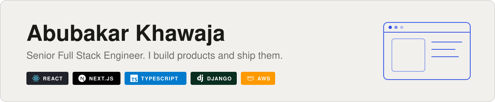
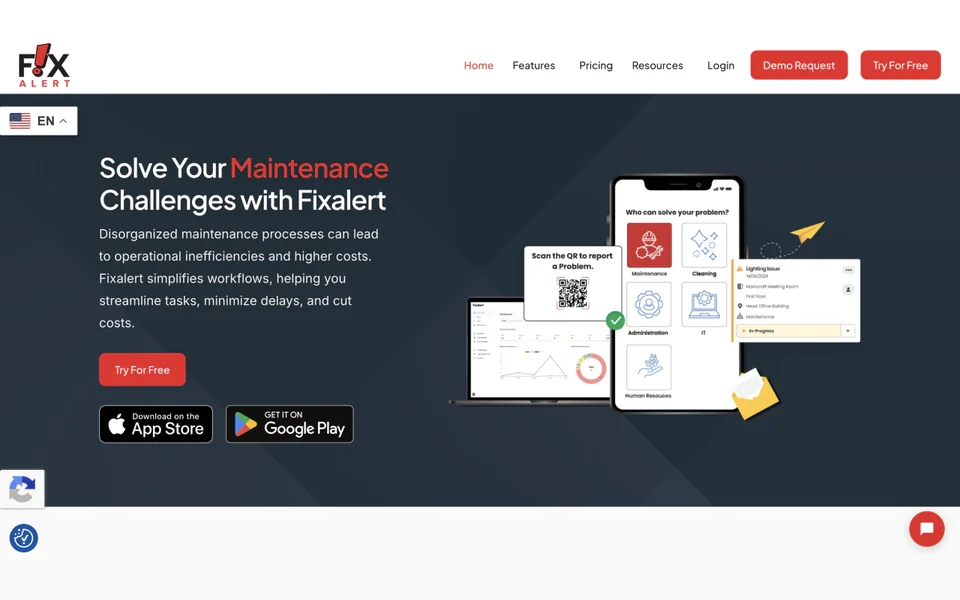
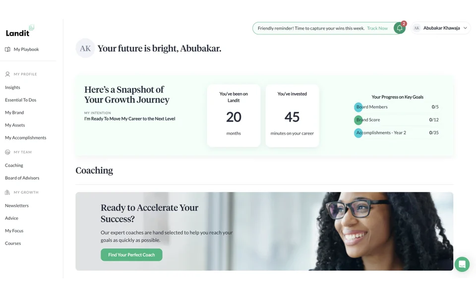
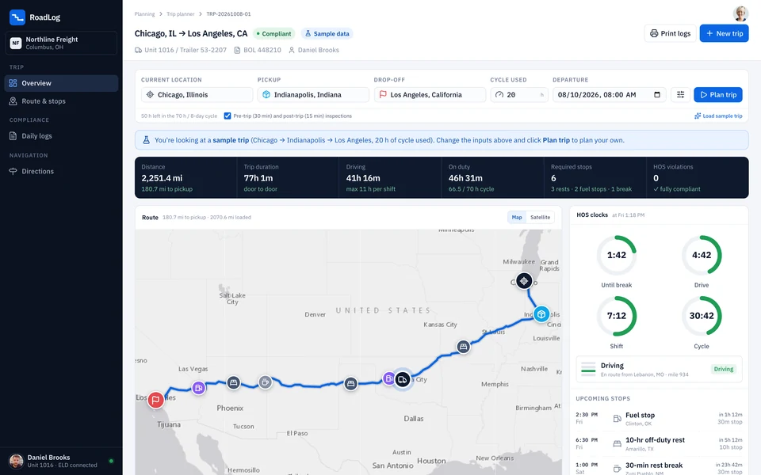
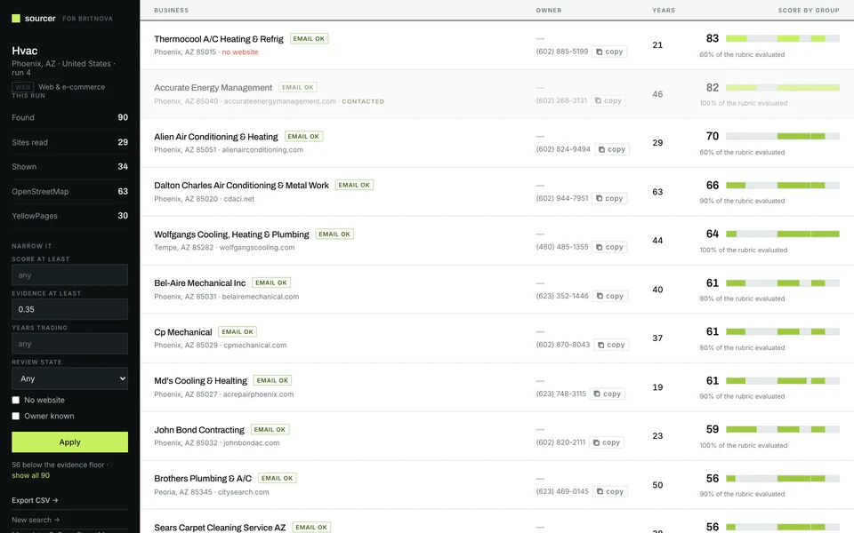
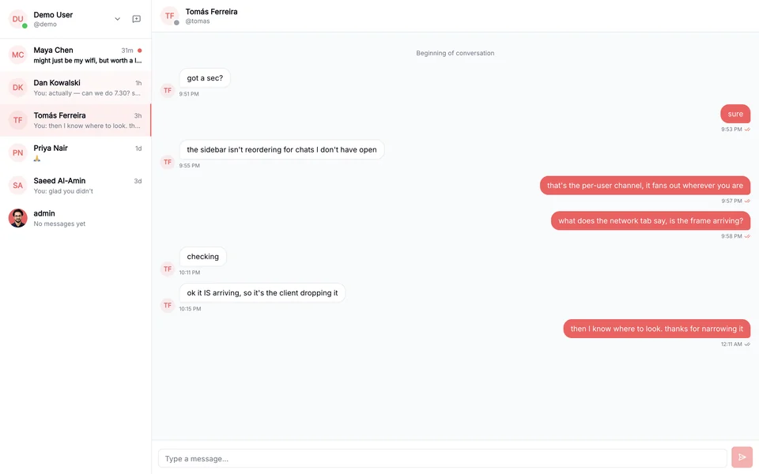
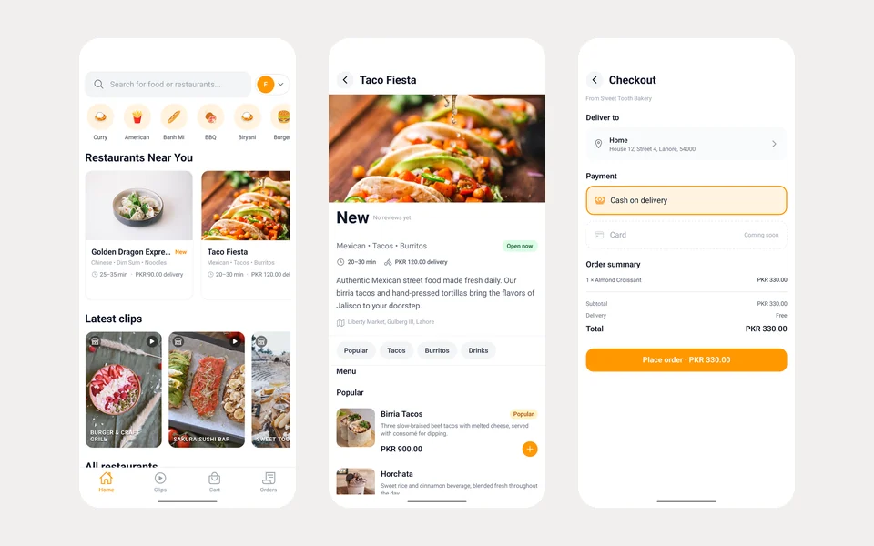
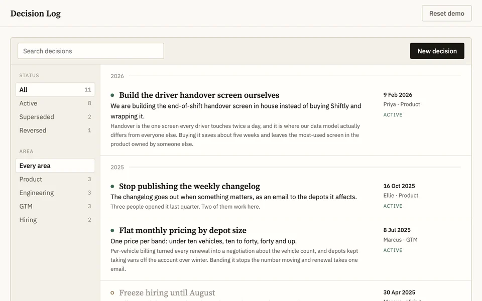
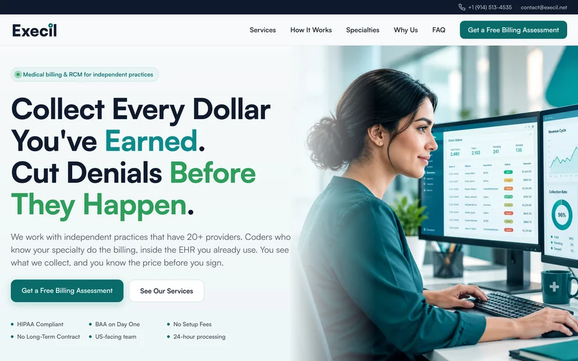

<a href="https://abuubkar.github.io">
<picture>
  <source media="(prefers-color-scheme: dark)" srcset="assets/banner-dark.svg">
  
</picture>
</a>

<a href="https://abuubkar.github.io"><b>Portfolio</b></a> ·
<a href="https://linkedin.com/in/abubakar-khawaja-008483183"><b>LinkedIn</b></a> ·
<a href="mailto:abubakar-dev@hotmail.com"><b>abubakar-dev@hotmail.com</b></a>

## 🏢 Client work · Arbisoft, 2021–2026

<table>
<tr>
<td width="33%" valign="top">

<h3>FixAlert</h3>
Maintenance platform · <a href="https://fixalert.io">fixalert.io</a>
<ul>
<li>Removed N+1 queries on core APIs</li>
<li>Celery pipelines for email and bulk PDFs</li>
<li>Stripe payments and reporting metrics</li>
</ul>
<code>React</code> <code>Django</code> <code>Celery</code> <code>Stripe</code>
</td>
<td width="33%" valign="top">

<h3>Landit</h3>
Career pathing · <a href="https://landit.com">landit.com</a>
<ul>
<li>Led MUI v4 → v5 and React Router migrations</li>
<li>Storybook components and frontend tests</li>
<li>Looker BI views and SendGrid templates</li>
</ul>
<code>React</code> <code>Next.js</code> <code>Storybook</code> <code>Cypress</code>
</td>
<td width="33%" valign="top">

<h3>AskImam</h3>
Full-stack · <a href="https://www.askimam.org/">askimam.org</a>
<ul>
<li>Led the Django 2.x → 5.1 migration</li>
<li>Admin dashboard and Google Analytics</li>
<li>Hardened authentication</li>
</ul>
<code>React</code> <code>Django</code> <code>Redux</code> <code>Vite</code>
</td>
</tr>
</table>

**Also:** **Rumi** (React + Django): frontend refactor to cut re-renders, Vitest suites, GitLab CI ·
**Taiga** (AngularJS + Django): built the Requestor and Feedback modules end to end

## 🛍️ Featured products

<table>
<tr>
<td width="50%" valign="top">

<h3>RoadLog</h3>
Trip planner for truck drivers: route map, every legally required stop, and auto-drawn ELD daily log sheets.  
<code>Django</code> <code>React</code> <code>TypeScript</code> <code>CI/CD</code>  
<a href="https://abuubkar.github.io/roadlog/"><b>▶ Live</b></a> · <a href="https://github.com/Abuubkar/roadlog">Code</a>
</td>
<td width="50%" valign="top">

<h3>Lead Finder</h3>
Finds small businesses in a trade and a city and ranks them as acquisition targets, naming the fact behind every point of the score.  
<code>Python</code> <code>FastAPI</code> <code>HTMX</code> <code>Anthropic API</code>  
<a href="https://lead-gen-liih.onrender.com"><b>▶ Live</b></a> · <a href="https://github.com/Abuubkar/lead-gen">Code</a>
</td>
</tr>
<tr>
<td width="50%" valign="top">
<a href="https://convo-lemon-three.vercel.app">
<picture>
  <source media="(prefers-color-scheme: dark)" srcset="assets/projects/convo-dark.webp">
  
</picture>
</a>
<h3>Convo</h3>
Real-time chat over WebSockets, with JWT auth, user profiles and avatar uploads.  
<code>React</code> <code>Django Channels</code> <code>Redis</code> <code>Tailwind</code>  
<a href="https://convo-lemon-three.vercel.app"><b>▶ Live</b></a> · <a href="https://github.com/Abuubkar/convo-web">Web</a> · <a href="https://github.com/Abuubkar/convo-backend">API</a>
</td>
<td width="50%" valign="top">

<h3>Foodio</h3>
Mobile app for food delivery and food reviews, backed by a restaurant-owned delivery API.  
<code>React Native</code> <code>NestJS</code> <code>Drizzle</code> <code>PostGIS</code>  
<a href="https://github.com/Abuubkar/foodio-mobile"><b>Code</b></a>
</td>
</tr>
</table>

## 📦 More I've built

| | Product | Built with | |
|:-:|:--|:--|:--|
|  | **Decision Log** What a team decided, why, and whether it still holds | React · TypeScript · StyleX | [Live](https://abuubkar.github.io/decision-log/) · [Code](https://github.com/Abuubkar/decision-log) |
|  | **Execil** Medical billing / RCM marketing site | TanStack Start · Cloudflare Workers · StyleX | [Live](https://execil.net/) · [Code](https://github.com/Abuubkar/execil) |

**Tools & experiments:**
[resume-toolkit](https://github.com/Abuubkar/resume-toolkit) (job-specific, provenance-checked resumes) ·
[ai-github-toolkit](https://github.com/Abuubkar/ai-github-toolkit) (AI PR review as a GitHub Action) ·
[Prototypes](https://abuubkar.github.io/prototypes/) (web products and sales demos)

## 🧰 Toolbox

