<a href="https://abuubkar.github.io">
<picture>
  <source media="(prefers-color-scheme: dark)" srcset="assets/banner-dark.svg">
  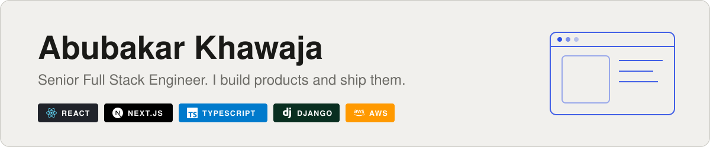
</picture>
</a>

<a href="https://abuubkar.github.io"><b>Portfolio</b></a> ·
<a href="https://linkedin.com/in/abubakar-khawaja-008483183"><b>LinkedIn</b></a> ·
<a href="mailto:abubakar-dev@hotmail.com"><b>abubakar-dev@hotmail.com</b></a>

## 🏢 Client work · Arbisoft, 2021–2026

<!-- cards:client -->

<a href="https://fixalert.io"><picture>
  <source media="(prefers-color-scheme: dark)" srcset="assets/cards/fixalert-dark.webp">
  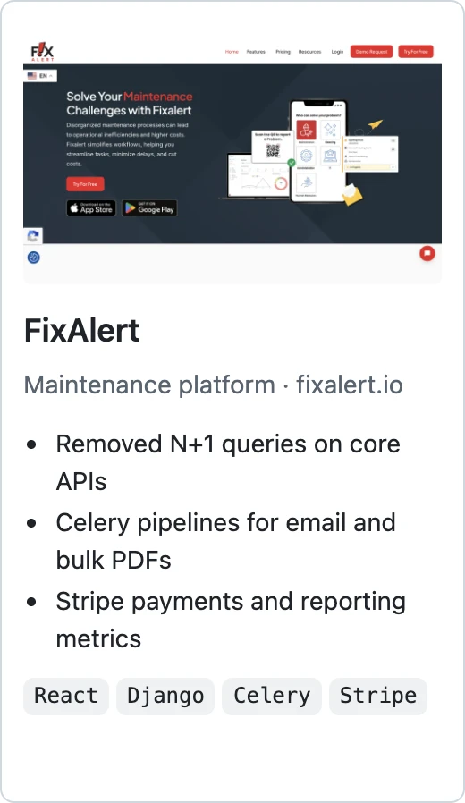
</picture></a>
<a href="https://landit.com"><picture>
  <source media="(prefers-color-scheme: dark)" srcset="assets/cards/landit-dark.webp">
  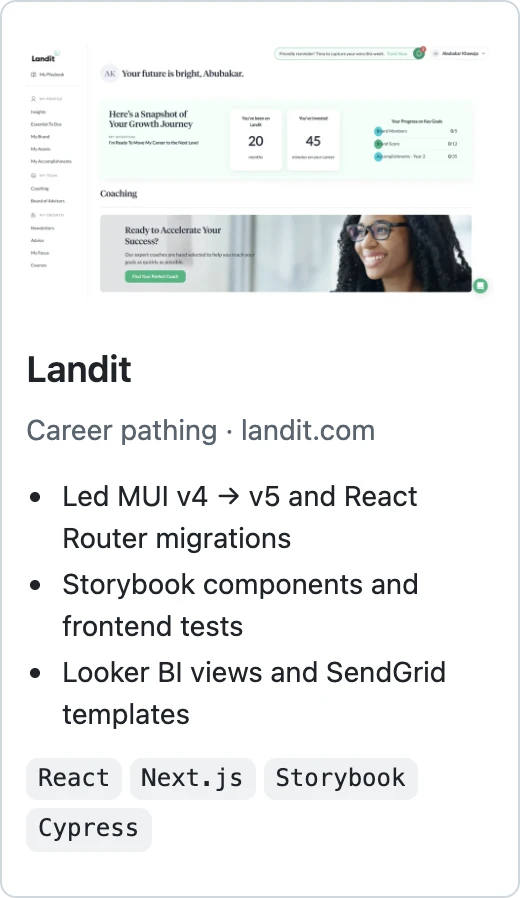
</picture></a>
<a href="https://www.askimam.org/"><picture>
  <source media="(prefers-color-scheme: dark)" srcset="assets/cards/askimam-dark.webp">
  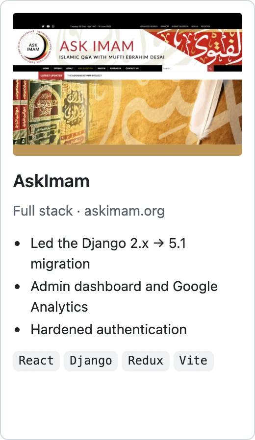
</picture></a>

<!-- /cards:client -->

**Also:** **Rumi** (React + Django): frontend refactor to cut re-renders, Vitest suites, GitLab CI ·
**Taiga** (AngularJS + Django): built the Requestor and Feedback modules end to end

## 🛍️ Featured products

<!-- cards:featured -->

<a href="https://no-more-mafia.abubakarkhawaja.workers.dev"><picture>
  <source media="(prefers-color-scheme: dark)" srcset="assets/cards/no-more-mafia-dark.webp">
  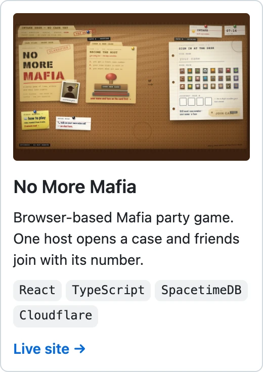
</picture></a>
<a href="https://github.com/Abuubkar/foodio-mobile"><picture>
  <source media="(prefers-color-scheme: dark)" srcset="assets/cards/foodio-dark.webp">
  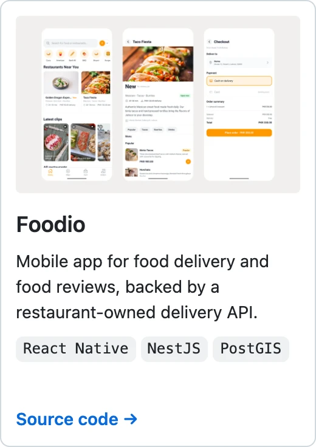
</picture></a>
<a href="https://convo-lemon-three.vercel.app"><picture>
  <source media="(prefers-color-scheme: dark)" srcset="assets/cards/convo-dark.webp">
  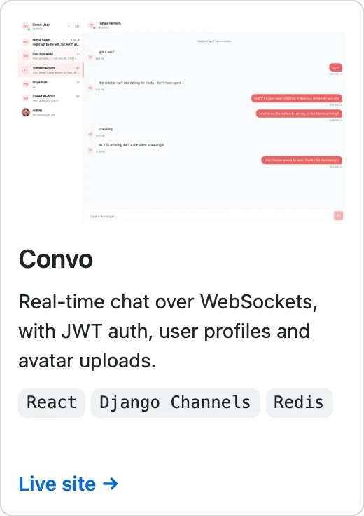
</picture></a>
<a href="https://safaremubarik.com/"><picture>
  <source media="(prefers-color-scheme: dark)" srcset="assets/cards/safar-e-mubarik-dark.webp">
  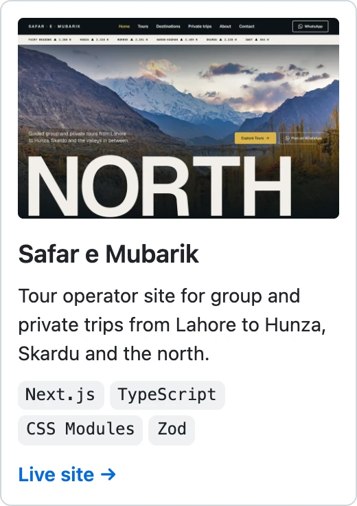
</picture></a>
<a href="https://britnova.net/"><picture>
  <source media="(prefers-color-scheme: dark)" srcset="assets/cards/britnova-dark.webp">
  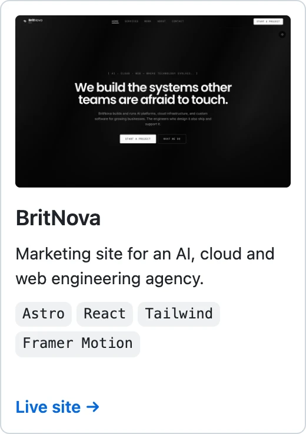
</picture></a>
<a href="https://execil.net/"><picture>
  <source media="(prefers-color-scheme: dark)" srcset="assets/cards/execil-dark.webp">
  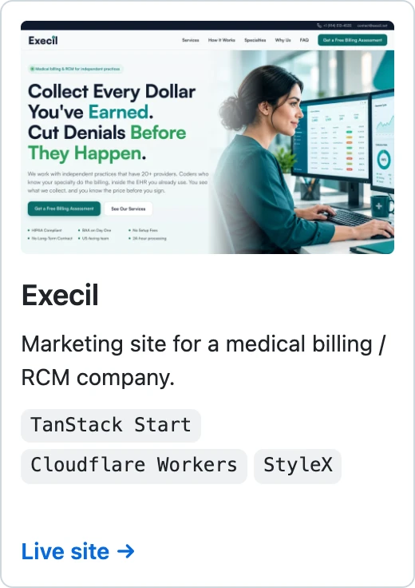
</picture></a>
<a href="https://abuubkar.github.io/roadlog/"><picture>
  <source media="(prefers-color-scheme: dark)" srcset="assets/cards/roadlog-dark.webp">
  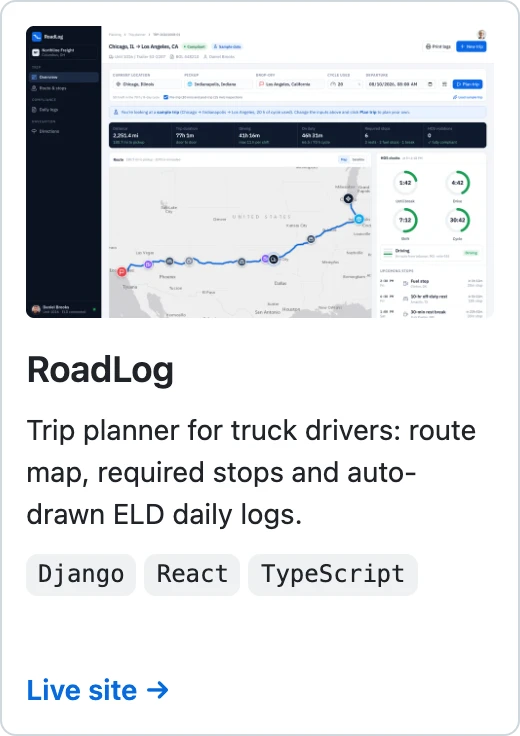
</picture></a>
<a href="https://lead-gen-liih.onrender.com"><picture>
  <source media="(prefers-color-scheme: dark)" srcset="assets/cards/lead-finder-dark.webp">
  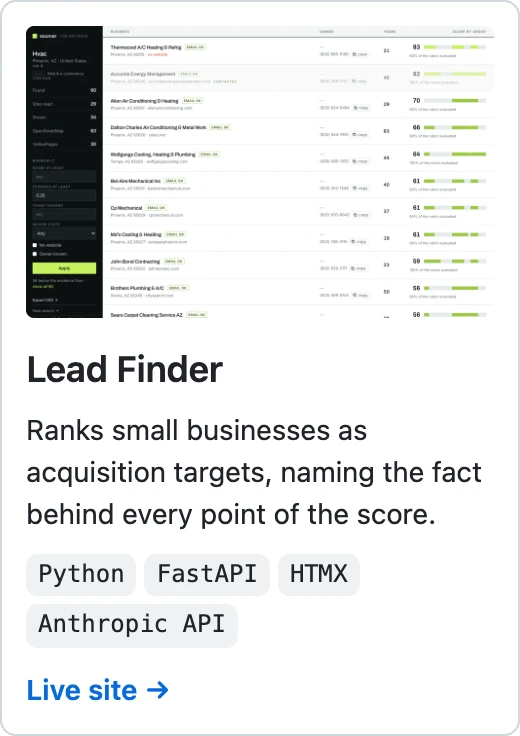
</picture></a>
<a href="https://abuubkar.github.io/decision-log/"><picture>
  <source media="(prefers-color-scheme: dark)" srcset="assets/cards/decision-log-dark.webp">
  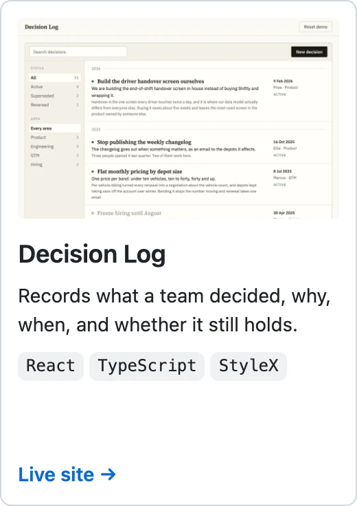
</picture></a>

<b>Source code:</b> <a href="https://github.com/Abuubkar/convo-web">Convo web</a> · <a href="https://github.com/Abuubkar/convo-backend">Convo API</a> · <a href="https://github.com/Abuubkar/roadlog">RoadLog</a> · <a href="https://github.com/Abuubkar/lead-gen">Lead Finder</a> · <a href="https://github.com/Abuubkar/decision-log">Decision Log</a>

<!-- /cards:featured -->

**Tools & experiments:**

- [resume-toolkit](https://github.com/Abuubkar/resume-toolkit): job-specific, provenance-checked resumes
- [ai-github-toolkit](https://github.com/Abuubkar/ai-github-toolkit): AI PR review as a GitHub Action
- [Prototypes](https://abuubkar.github.io/prototypes/): web products and sales demos

## 🧰 Toolbox

